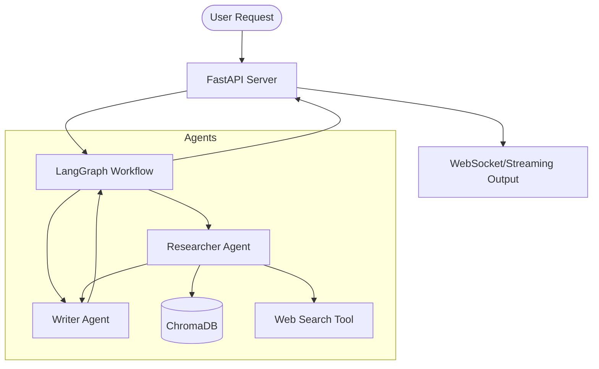

# Advanced GenAI Orchestrator

An enterprise-grade orchestration framework for multi-agent LLM systems, leveraging LangGraph for stateful workflow management and ChromaDB for vector-based Agentic RAG.

## Architecture



## Features

- **Multi-Agent Orchestration**: Coordinated workflows between specialized Researcher and Writer agents using `LangGraph`.
- **Agentic RAG**: Advanced retrieval-augmented generation where agents decide when and how to query the knowledge base.
- **Stateful Workflows**: Built-in state management for long-running reasoning tasks.
- **Streaming Support**: Real-time response streaming via FastAPI and WebSockets.
- **Vector Storage**: Integrated with `ChromaDB` for high-performance semantic search.

## Deployment Instructions

### Prerequisites
- Python 3.9+
- OpenAI API Key

### Installation

1. Clone the repository:
   ```bash
   git clone <repository-url>
   cd Advanced-GenAI-Orchestrator
   ```

2. Install dependencies:
   ```bash
   pip install -r requirements.txt
   ```

3. Set up environment variables:
   ```bash
   echo "OPENAI_API_KEY=your_key_here" > .env
   ```

4. Run the server:
   ```bash
   uvicorn api.server:app --reload
   ```

## Agentic RAG Overview

Unlike standard RAG, **Agentic RAG** empowers the LLM to act as an autonomous agent that can:
1. Decompose complex queries into sub-tasks.
2. Selectively retrieve information based on task requirements.
3. Validate retrieved results and re-query if necessary.
4. Synthesize final responses using multi-step reasoning.
